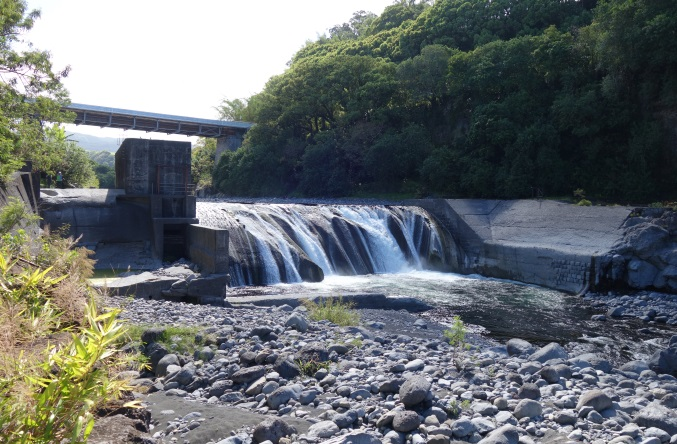

```{r, echo=FALSE}
pacman::p_load(tidyverse, flexdashboard, sf, ggplot2, plotly, splitstackshape, RCurl, scales, htmlwidgets, treemap, d3treeR, eulerr)

knitr::opts_chunk$set(echo = FALSE, warning = FALSE, include = FALSE, eval = FALSE)

load("data/processed/data_roe.rda")
```


# Le référentiel des obstacles à l'écoulement (ROE) {#roe}

<br>

> **Obstacle à l'écoulement** : ouvrage construit dans le lit d'un cours d’eau et à l’origine d’une modification de l’écoulement des eaux de surface. 

Le ROE est un dispositif national participatif, coordonné par l’Agence Française pour la Biodiversité, permettant la centralisation et l’unification du recensement toujours en cours des obstacles artificiels (provenant de l’activité humaine, e.g. barrages, seuils) à l’écoulement des eaux de surface (dans les talwegs, lits mineurs et majeurs de cours d’eau et zones de submersion marine) sur le territoire français, outre-mer inclus.

<div class = "tip">
*Des informations détaillées sont disponibles en interaction avec les graphiques (survol, clic), prenez le temps de les explorer.*
<br>
*Les ruptures de pente, sur le graphe ci-contre, correspondent à des imports en masse de données.*
</div>

Depuis sa mise en place en 2009, le référentiel est complété de manière régulière par plusieurs centaines de contributeurs, des services de l’Etat aux acteurs locaux (syndicats de rivière, associations environnementales, bureaux d'étude…) investis dans l'étude et la gestion des cours d'eau. Il dépasse désormais 100 000 obstacles recensés. Parmi ces obstacles, certains sont totalement ou partiellement détruits (du fait ou non d’une intervention humaine) ; seuls les ouvrages non détruits seront pris en compte.

<iframe width="100%" height="100%" frameborder="0" scrolling="no" src="https://plot.ly/~AFB-dataviz/1.embed"></iframe>

# Typologie des obstacles existants {#typologie}

<br>

Les obstacles recensés se répartissent selon 6 types principaux. Chacun de ces types principaux comporte des sous-types se différenciant par leurs caractéristiques ou leur mode de construction.

<div class = "tip">

*Dans le graphe ci-contre, les détails par sous-types sont accessibles en cliquant sur le type. Le retour se fait en cliquant sur la barre de titre ('Types d'obstacles à l'écoulement').*

</div>

```{r}
n_types <- data_roe %>% 
  filter(etat_ouvrage == "Existant") %>% 
  mutate(code_type_principal = str_sub(code_type, start = 1L, end = 3L)) %>% 
  group_by(code_type_principal) %>% 
  summarise(n = n_distinct(code_obstacle)) %>% 
  mutate(p = round(100 * n / sum(n)))

n_sub_types <- data_roe %>% 
  filter(etat_ouvrage == "Existant") %>% 
  group_by(code_type) %>% 
  summarise(n = n_distinct(code_obstacle)) %>% 
  mutate(p = round(100 * n / sum(n)))

# pourcentage d'obstacles de sous-type déversoir
filter(n_sub_types, code_type == "1.2.1")$p
# pourcentage des seuils, obstacles liés aux ponts, barrages
sum(filter(n_types, code_type_principal %in% c("1.1", "1.2", "1.4"))$p)

```

Les seuils en rivière de sous-type déversoirs sont les obstacles les plus fréquents (environ 30% des obstacles décrits). Les trois types principaux (seuils, obstacles induits par des ponts, barrages) représentent 98% des obstacles existants recensés.

<iframe width="100%" height="100%" frameborder="0" scrolling="no" src="roe_01_types_ouvrages.html"></iframe>

# Usages des obstacles {#usages1}

```{r}
n_usages <- data_roe %>% 
  filter(etat_ouvrage == "Existant",
         str_detect(string = code_type,
                    pattern = "^1\\.1|^1\\.2|^1\\.4")) %>% 
  mutate(usage = if_else(code_usage == 0, "inconnu", "connu")) %>% 
  group_by(usage) %>% 
  summarise(n = n_distinct(code_obstacle)) %>% 
  mutate(p = round(100 * n / sum(n)))

# pourcentage d'obstacles sans information sur l'usage
filter(n_usages, usage == "inconnu")$p
```

<br>

Pour les trois types principalement recensés, **41% des obstacles sont sans information concernant leurs usages**.

<iframe width="100%" height="100%" frameborder="0" scrolling="no" src="https://plot.ly/~AFB-dataviz/3.embed"></iframe>

# {#usages2}

```{r}
n_usages_detail <-  data_roe %>% 
  filter(etat_ouvrage == "Existant",
         code_usage != 0,
         str_detect(string = code_type,
                    pattern = "^1\\.1|^1\\.2|^1\\.4")) %>% 
  mutate(code_type_principal = str_sub(code_type, start = 1L, end = 3L)) %>% 
  group_by(code_usage, code_type_principal) %>% 
  summarise(n = n_distinct(code_obstacle)) %>% 
  group_by(code_usage) %>% 
  mutate(n_tot = sum(n)) %>% 
  arrange(desc(n_tot), desc(n)) %>% 
  ungroup() %>% 
  left_join(typo_usage, by = "code_usage") %>% 
  left_join(typo_ouvrage, by = c("code_type_principal" = "code_type"))

paste_and <- function(x) {
  paste(
    paste(x[-length(x)], collapse = ", "),
    "et",
    x[length(x)]
  )
}

n_aucun <- filter(n_usages_detail, label_usage %in% c("Aucun", "Obsolète")) %>% 
  group_by(code_type_principal) %>% 
  summarise(n = sum(n)) %>% 
  left_join(typo_ouvrage, by = c("code_type_principal" = "code_type")) %>% 
  mutate(label_type = case_when(
    label_type == "Barrage" ~ "Barrages",
    label_type == "Seuil en rivière" ~ "Seuils en rivière",
    label_type == "Obstacle induit par un pont" ~ "Obstacles induits par un pont"
  ))

# nombre d'obstacles sans usage
format(floor(sum(n_aucun$n) / 1000) * 1000, big.mark = " ", scientific = FALSE)
# proportion d'obstacles sans usage
round(100 * sum(n_aucun$n) / sum(n_usages_detail$n))
# type majoritaire sans usage
filter(n_aucun, n == max(n))$label_type
```

Les usages des principaux types d’obstacles sont très divers et peuvent être multiples (plusieurs usages peuvent être associés à un ouvrage). **Plus de 15 000 obstacles (30%) sont sans usage actuel recensé**, majoritairement de type 'seuils en rivière'.

**Les barrages sont principalement associés à l’agriculture, les loisirs et la production hydroélectrique. Les seuils présentent des usages très diversifiés, le principal étant la stabilisation du lit / lutte contre l’érosion. En toute logique les obstacles induits par un pont sont majoritairement associés à une problématique de transport.**

<iframe width="100%" height="100%" frameborder="0" scrolling="no" src="https://plot.ly/~AFB-dataviz/5.embed"></iframe>

# Hauteur de chute selon les usages {#chutes}

```{r}
data_usage <- data_roe %>% 
  filter(etat_ouvrage == "Existant",
         label_type_principal %in% c("Seuil en rivière", "Barrage", "Obstacle induit par un pont"),
         !label_usage %in% c("Aucun", "Obsolète", "Type d'usage inconnu")) %>%
  group_by(code_usage, label_usage) %>% 
  summarise(oui = sum(!is.na(code_chute) & code_chute != 0),
            non = sum(is.na(code_chute) |  code_chute == 0)) %>% 
  gather(-ends_with("usage"), key = renseignement, value = nombre) %>% 
  group_by(label_usage) %>% 
  mutate(nombre_total = sum(nombre)) %>% 
  ungroup() %>% 
  mutate(pourcentage = round(100 * nombre / nombre_total)) 

# renseignement hauteur de chute
round(100 * sum(filter(data_usage, renseignement == "oui")$nombre) / sum(data_usage$nombre))
# renseignement minimum
filter(data_usage, renseignement == "oui") %>% filter(pourcentage == min(pourcentage)) %>% pull(pourcentage)
# renseignement maximum
filter(data_usage, renseignement  == "oui") %>% filter(pourcentage == max(pourcentage)) %>% pull(pourcentage)
```

<br>

Quel que soit le type d’obstacle considéré (seuil, barrage ou obstacle induit par un pont), les ouvrages induisent un dénivelé entre les lignes d'eau amont et aval, ce qui génère une chute d'eau dont l'importance est liée à leurs dimensions (notamment l'emprise verticale)

> **Hauteur de chute** : dénivelé entre les cotes des lignes d’eau amont et aval apprécié, dans le cadre du ROE, à l’étiage (conditions de dénivelé maximal pour la plupart des ouvrages).

Ces hauteurs de chutes sont renseignées pour 62% des obstacles, le taux de renseignement variant de 56% à 85% en fonction de leurs usages connus.

La hauteur de chute est très variable quel que soit l'usage des obstacles. Néanmoins, l'usage conditionne indirectement une hauteur de chute plus ou moins élevée. Par exemple, les ouvrages associés à la production d'énergie et d'hydroélectricité montrent majoritairement des hauteurs de chutes plus importantes que les ouvrages ayant d'autres usages.

<iframe width="100%" height="100%" frameborder="0" scrolling="no" src="https://plot.ly/~AFB-dataviz/7.embed"></iframe>

# Dispositifs de franchissement piscicole {#dispositifs}

Les obstacles à l'écoulement ne modifient pas seulement l'écoulement des eaux, mais sont également susceptibles de perturber le transit sédimentaire et les déplacements de certains organismes aquatiques, notamment les poissons. Afin de réduire l'impact des obstacles sur la libre circulation des poissons le long des cours d'eau, des dispositifs de franchissement peuvent être aménagés sur les ouvrages transversaux.

> **Dispositif de franchissement piscicole** : équipement permettant aux poissons de franchir un ouvrage afin de faciliter leur libre circulation à la montaison ou à la dévalaison.


```{r}
data_roe %>% 
  filter(etat_ouvrage == "Existant",
         label_type_principal %in% c("Seuil en rivière", "Barrage", "Obstacle induit par un pont"),
         !is.na(code_chute) & code_chute != 0) %>%
  mutate(label_dispo = if_else(label_dispo == "Absence d'information",
                               NA_character_, label_dispo)) %>% 
  summarise(n_distinct(code_obstacle[!is.na(label_dispo)]) / n_distinct(code_obstacle))

data_roe %>% 
  filter(etat_ouvrage == "Existant",
         label_type_principal %in% c("Seuil en rivière", "Barrage", "Obstacle induit par un pont"),
         !is.na(code_chute) & code_chute != 0) %>% 
  mutate(equipement = !(label_dispo %in% c("Absence d'information", "Absence de passe"))) %>% 
  group_by(code_chute, label_chute) %>% 
  summarise(taux_equipement = 100 * n_distinct(code_obstacle[equipement]) / n_distinct(code_obstacle)) 

```

Le taux de renseignement sur la présence et le type de dispositifs de franchissement pour les types d'ouvrage principaux est de 68% en moyenne mais varie selon les différentes classes de hauteurs de chute, les classes les plus élevées étant les mieux renseignées.

**Parmi les obstacles pour lesquels la présence d'un dispositif de franchissement est renseigné, le taux d'équipement est plus faible (2-4%) pour les obstacles avec de faibles hauteurs de chute renseignées (< 1m) en comparaison avec les obstacles ayant des hauteurs de chute renseignées supérieures (7-13%).**

Les dispositifs de franchissement sont de natures variées et peuvent équiper des obstacles de hauteurs variables. Néanmoins certains dispositifs sont plutôt spécifiques de grands ouvrages (plus de 5m : ascenseur ou écluse à poisson) alors que d’autres se rencontrent majoritairement pour des obstacles de taille plus modérée (rampe et pré-barrage).

<iframe width="100%" height="100%" frameborder="0" scrolling="no" src="https://plot.ly/~AFB-dataviz/9.embed"></iframe>

# Conclusion {#conclusion}

De par leur présence et/ou leurs modalités de gestion, les obstacles à l’écoulement des eaux peuvent parfois, selon leurs natures et leurs usages,  modifier la structure et le fonctionnement des écosystèmes en altérant les possibilités de déplacement des organismes aquatiques   et en modifiant, voire dégradant, la qualité des milieux aquatiques (réduction des habitats disponibles en amont et en aval, modification de l'hydrologie, de la qualité de l'eau …).  

A travers un aperçu du contenu du ROE, ce dataviz illustre de manière synthétique la grande variété des ouvrages transversaux construits au sein des cours d’eau par l'homme pour ses divers usages au fil des siècles.   

La mise en œuvre de mesures de gestion conciliant enjeux écologiques et usages au niveaux des ouvrages transversaux nécessite leur recensement et l’acquisition d’informations fiables : une connaissance commune et partagée, enrichie chaque jour et à laquelle chacun peut contribuer : https://geobs.brgm.fr/



